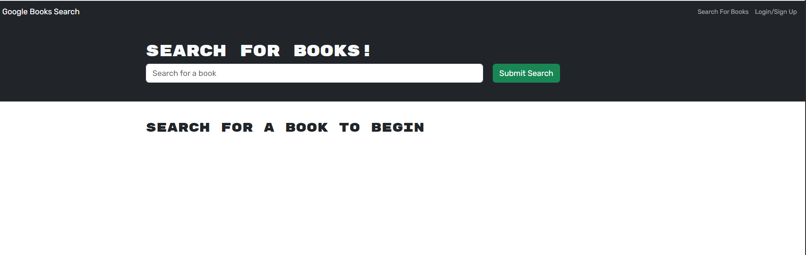

# **Googlebooks Search App**

  [](https://opensource.org/licenses/MIT)

  ## **Description**
  This **Googlebooks Search App** is a Google Books search engine with a GraphQL API built with Apollo Server. The app was built using the MERN stack, with a React front end, MongoDB database, and Node.js/Express.js server and API. It allows users to save book searches to the back end. 

  ## **Table of Contents:**
  * [Installation](#installation)
  * [Screenshot of app](#screenshot-of-app) 
  * [Link to deployed app via Heroku](#link-to-deployed-app-via-heroku)
  * [Usage](#usage)
  * [Credits](#credits)
  * [Contribute](#contribute)
  * [License](#license)
  * [GitHub Repository](#github-repository)
  * [Questions](#questions)

  
  ## **Installation**
  To download the source code for this app, clone the [Googlebooks Search App GitHub repo](https://github.com/DonnaThompson7/Googlebooks-Search-App), then run `npm install`. This will create the node_modules directory in your current directory (if one doesnt exist yet) and will download the package to that directory. You can check to see if you already have node.js installed by running either the npm -v or the npm version command. Note:If there is no package.jsonfile in the local directory, the latest version of the package is installed. To start the app, run `npm start`.

  ## **Screenshot of app**
 
  

  ## **Link to deployed app via Heroku**
 [Link to deployed app](https://morning-sierra-83538-7272b75177cb.herokuapp.com/)
 
  ## **Usage**

  This book search app satisfies the following requirements:
  
  User Story 
```md
AS AN avid reader
I WANT to search for new books to read
SO THAT I can keep a list of books to purchase
```
Acceptance Criteria
```md
GIVEN a book search engine
WHEN I load the search engine
THEN I am presented with a menu with the options Search for Books and Login/Signup and an input field to search for books and a submit button
WHEN I click on the Search for Books menu option
THEN I am presented with an input field to search for books and a submit button
WHEN I am not logged in and enter a search term in the input field and click the submit button
THEN I am presented with several search results, each featuring a book’s title, author, description, image, and a link to that book on the Google Books site
WHEN I click on the Login/Signup menu option
THEN a modal appears on the screen with a toggle between the option to log in or sign up
WHEN the toggle is set to Signup
THEN I am presented with three inputs for a username, an email address, and a password, and a signup button
WHEN the toggle is set to Login
THEN I am presented with two inputs for an email address and a password and login button
WHEN I enter a valid email address and create a password and click on the signup button
THEN my user account is created and I am logged in to the site
WHEN I enter my account’s email address and password and click on the login button
THEN I the modal closes and I am logged in to the site
WHEN I am logged in to the site
THEN the menu options change to Search for Books, an option to see my saved books, and Logout
WHEN I am logged in and enter a search term in the input field and click the submit button
THEN I am presented with several search results, each featuring a book’s title, author, description, image, and a link to that book on the Google Books site and a button to save a book to my account
WHEN I click on the Save button on a book
THEN that book’s information is saved to my account
WHEN I click on the option to see my saved books
THEN I am presented with all of the books I have saved to my account, each featuring the book’s title, author, description, image, and a link to that book on the Google Books site and a button to remove a book from my account
WHEN I click on the Remove button on a book
THEN that book is deleted from my saved books list
WHEN I click on the Logout button
THEN I am logged out of the site and presented with a menu with the options Search for Books and Login/Signup and an input field to search for books and a submit button
```

  ## **Credits**
  Donna Thompson, developer

  Starter code: UNCC-VIRT-FSF-PT-04-2023-U-LOLC, Module 21 MERN, Challenge

  ## **Contribute**
  If you would like to contribute to this app, please submit contributions to the email below.

  ## **License**
Licensed under [The MIT License](https://opensource.org/licenses/MIT).

  ## **GitHub Repository** 
  [github.com/DonnaThompson7/Googlebooks-Search-App](https://github.com/DonnaThompson7/Googlebooks-Search-App)

  ## **Questions**
  Please visit my GitHub profile at https://github.com/DonnaThompson7 <br /> Contact me at dlthompson7@icloud.com to report issues, contribute, or if you have additional questions.
